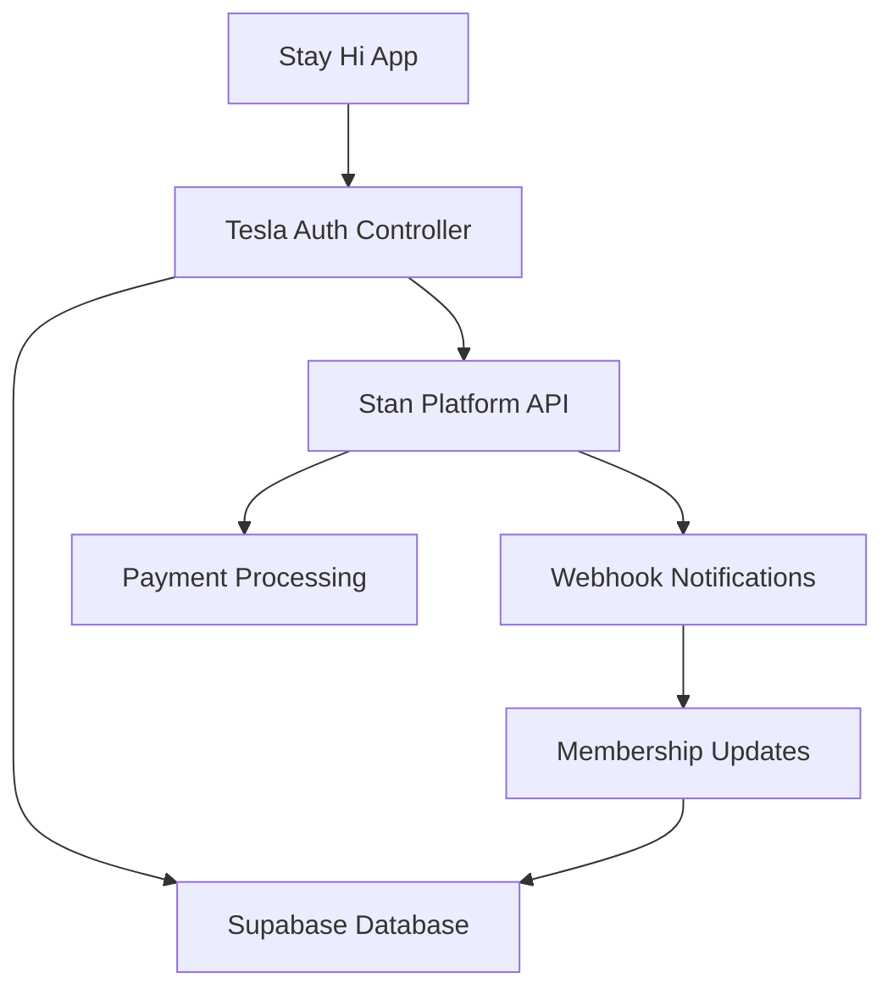

# 🚀 **TESLA-GRADE AUTHENTICATION & MEMBERSHIP DEPLOYMENT STRATEGY**

## **📊 EXECUTIVE SUMMARY**

**Mission**: Deploy a bulletproof authentication and membership system that enables secure user invitations, trials, subscriptions, and cancellations without app store restrictions.

**Key Achievement**: Transform Stay Hi from demo app to production-ready service with Tesla-grade security and scalability.

---

## **🏗️ ARCHITECTURE OVERVIEW**

### **🔒 Authentication Layer**
- **Tesla Auth Controller**: Centralized authentication management
- **Feature Flag Integration**: Gradual rollout capability for all auth features
- **Hybrid Mode**: Seamless guest → trial → paid member progression
- **Real-time Monitoring**: Auth health monitoring and automatic recovery

### **💎 Membership System**
- **5-Tier Structure**: Trial → Beta → Standard → Premium → Lifetime
- **Flexible Trials**: 7-day standard, 30-day beta, custom admin codes
- **Billing Integration**: Stan platform middleware (no app store fees)
- **Graceful Cancellation**: Access retention until subscription end date

### **🎛️ Admin Control Center**
- **User Management**: Search, suspend, upgrade/downgrade members
- **Feature Flag Control**: Real-time feature toggles across environments
- **Analytics Dashboard**: User engagement, conversion, churn metrics
- **Invitation Management**: Bulk code generation, usage tracking

---

## **📈 BETA TESTING PIPELINE**

### **Phase 1: Internal Testing (Week 1)**
```sql
-- Enable beta features for core team
UPDATE user_memberships SET 
  tier = 'beta',
  features_enabled = ARRAY['basic_sharing', 'hi_waves', 'rewards_system', 'beta_features']
WHERE user_id IN (SELECT id FROM auth.users WHERE email LIKE '%@stayhi.com');
```

**Features to Test:**
- Enhanced welcome page with new aesthetic
- Tesla Auth Controller sign-in/sign-out flow
- Feature flag toggles (rewards on/off)
- Basic membership transitions

### **Phase 2: Trusted Beta (Week 2-3)**
```sql
-- Generate beta invitation codes
INSERT INTO invitation_codes (code, code_type, max_uses, trial_days, grants_tier, description)
VALUES 
  ('BETA50USER', 'beta', 50, 30, 'beta', 'Trusted beta tester program'),
  ('FRIENDS25', 'beta', 25, 30, 'beta', 'Friends and family beta');
```

**Beta Tester Criteria:**
- Existing users with high engagement (5+ shares, 20+ waves)
- Personal network invitations (friends/family)
- Professional network (design/tech community)
- Max 75 beta testers for manageable feedback

**Beta Features:**
- Full Hi Rewards system (controlled via feature flags)
- Advanced profile customization
- Priority customer support
- Feedback collection system

### **Phase 3: Public Beta (Week 4)**
```sql
-- Increase feature flag rollout to 10% of users
UPDATE feature_flags SET 
  rollout_percentage = 10,
  environments = ARRAY['production']
WHERE flag_key = 'rewards_enabled';
```

**Public Beta Launch:**
- Landing page with beta sign-up
- Limited public invitation codes (100 uses each)
- Social media announcement
- Feedback collection and iteration

---

## **💰 STAN PAYMENT INTEGRATION STRATEGY**

### **Why Stan Platform?**
✅ **No App Store Fees**: Direct subscription management  
✅ **Creator-Friendly**: Built for content creators and communities  
✅ **Flexible Pricing**: Supports trials, tiers, and custom pricing  
✅ **Global Support**: International payment processing  
✅ **Simple Integration**: Webhook-based subscription management  

### **Integration Architecture**



### **Stan Integration Implementation**

#### **1. Stan Subscription Creation**
```javascript
// When user upgrades from trial
async function createStanSubscription(userEmail, tier) {
  const response = await fetch('https://api.stan.store/v1/subscriptions', {
    method: 'POST',
    headers: {
      'Authorization': `Bearer ${STAN_API_KEY}`,
      'Content-Type': 'application/json'
    },
    body: JSON.stringify({
      customer_email: userEmail,
      plan_id: getStanPlanId(tier), // Map tier to Stan plan
      trial_days: 0, // Already used our internal trial
      metadata: {
        stay_hi_user_id: getCurrentUserId(),
        source: 'stay_hi_app'
      }
    })
  });
  
  const subscription = await response.json();
  
  // Update our database with Stan subscription ID
  await updateMembershipWithStan(subscription.id);
}
```

#### **2. Webhook Processing**
```javascript
// Webhook endpoint: /api/stan-webhooks
async function handleStanWebhook(event) {
  const { type, subscription, customer } = event.data;
  
  switch (type) {
    case 'subscription.payment_success':
      await renewMembership(subscription.metadata.stay_hi_user_id);
      break;
      
    case 'subscription.cancelled':
      await cancelMembership(subscription.metadata.stay_hi_user_id, 'payment_cancelled');
      break;
      
    case 'subscription.payment_failed':
      await handleFailedPayment(subscription.metadata.stay_hi_user_id);
      break;
  }
}
```

#### **3. Subscription Management**
```sql
-- Update membership schema for Stan integration
ALTER TABLE user_memberships ADD COLUMN IF NOT EXISTS stan_subscription_id TEXT;
ALTER TABLE user_memberships ADD COLUMN IF NOT EXISTS stan_plan_id TEXT;
ALTER TABLE user_memberships ADD COLUMN IF NOT EXISTS next_billing_date TIMESTAMPTZ;
```

### **Pricing Strategy**

#### **Trial Phase (Free)**
- 7-day trial for all new users
- Access to basic sharing and hi waves
- Limited to 10 shares/day, 50 waves/day
- No rewards system access

#### **Standard Tier ($4.99/month via Stan)**
- Unlimited sharing and hi waves
- Full Hi Rewards system access
- Profile customization
- Priority support

#### **Premium Tier ($9.99/month via Stan)**
- Everything in Standard
- Advanced analytics dashboard
- Early access to new features
- Custom profile themes
- Beta feature access

#### **Lifetime ($99 one-time via Stan)**
- All Premium features forever
- Founder badge
- Direct feedback channel
- Feature request priority

---

## **🔄 CANCELLATION & RETENTION STRATEGY**

### **Graceful Cancellation Process**

#### **1. User-Initiated Cancellation**
```javascript
async function initiateCancellation(reason) {
  // Update local membership status
  const result = await window.TeslaAuth.cancelMembership(reason);
  
  // Cancel Stan subscription (but retain access until end date)
  await fetch('https://api.stan.store/v1/subscriptions/${stanSubscriptionId}/cancel', {
    method: 'POST',
    headers: { 'Authorization': `Bearer ${STAN_API_KEY}` },
    body: JSON.stringify({
      cancel_at_period_end: true // Keep access until billing period ends
    })
  });
  
  // Show retention offer
  showRetentionOffer(reason);
}
```

#### **2. Retention Offers**
```javascript
function showRetentionOffer(cancellationReason) {
  const offers = {
    'too_expensive': {
      title: '50% Off Next 3 Months',
      description: 'We understand budget is important. Here\'s a special offer just for you.',
      discount: 50,
      duration: 3
    },
    'not_using_enough': {
      title: 'Free Premium Features',
      description: 'Unlock advanced features that might change your mind.',
      trial_extension: 14,
      upgrade_tier: 'premium'
    },
    'technical_issues': {
      title: 'Priority Support + Free Month',
      description: 'Let us fix your issues and give you a free month.',
      support_priority: true,
      free_months: 1
    }
  };
  
  const offer = offers[cancellationReason] || offers.default;
  showModal('retention-offer', offer);
}
```

#### **3. Post-Cancellation Experience**
- **Immediate**: Access continues until billing end date
- **7 days before expiry**: "We miss you" email with reactivation offer
- **On expiry**: Account downgrades to free tier (limited features)
- **30 days post-expiry**: Win-back campaign with special pricing

### **Reactivation Workflow**
```javascript
async function reactivateSubscription(userId) {
  // Check if user is within reactivation window (30 days)
  const membership = await getMembership(userId);
  
  if (isReactivationEligible(membership)) {
    // Offer previous tier at discounted rate
    return {
      eligible: true,
      previous_tier: membership.tier,
      discount_percentage: 25,
      discount_duration: 6 // months
    };
  }
  
  // Otherwise, regular pricing
  return { eligible: false };
}
```

---

## **📊 SUCCESS METRICS & MONITORING**

### **KPIs to Track**

#### **Authentication Metrics**
- Sign-up completion rate: >85%
- Email verification rate: >90%
- Sign-in success rate: >98%
- Password reset usage: <5%

#### **Trial → Paid Conversion**
- Trial start rate: 60% of sign-ups
- Trial completion rate: 70% (use full 7 days)
- Trial → paid conversion: 25%
- Beta → paid conversion: 45%

#### **Retention Metrics**
- Month 1 retention: >80%
- Month 3 retention: >60%
- Month 6 retention: >45%
- Voluntary churn rate: <8%/month

#### **Feature Adoption**
- Hi Rewards engagement: >70% of paid users
- Share feature usage: >90% weekly active
- Profile completion: >85% of users

### **Real-time Monitoring Dashboard**

#### **Admin Analytics Panel**
```javascript
// Real-time metrics display
const adminMetrics = {
  activeUsers: 'SELECT COUNT(*) FROM user_memberships WHERE status = "active"',
  trialConversions: 'SELECT conversion_rate FROM daily_analytics WHERE date = CURRENT_DATE',
  churnRate: 'SELECT churn_rate FROM monthly_analytics WHERE month = EXTRACT(month FROM NOW())',
  revenueGrowth: 'SELECT revenue_growth FROM revenue_analytics ORDER BY date DESC LIMIT 1'
};
```

#### **Alert System**
- **High Priority**: Payment failures, auth errors, feature flag failures
- **Medium Priority**: Trial expiration reminders, high churn alerts
- **Low Priority**: Feature usage anomalies, user feedback

---

## **🚀 DEPLOYMENT TIMELINE**

### **Week 1: Foundation**
✅ **Authentication System**: Deploy Tesla Auth Controller  
✅ **Database Schema**: Run membership schema migrations  
✅ **Feature Flags**: Enable core authentication flags  
✅ **Admin Panel**: Deploy Tesla Admin Dashboard  

### **Week 2: Beta Testing**
🔄 **Internal Beta**: Core team testing (5-10 users)  
🔄 **Bug Fixes**: Address critical issues  
🔄 **Feature Polish**: UX improvements  
🔄 **Documentation**: Admin and user guides  

### **Week 3: Trusted Beta**
📋 **Expand Beta**: 50 trusted users  
📋 **Feedback Collection**: Feature usage analytics  
📋 **Stan Integration**: Payment system testing  
📋 **Retention Testing**: Cancellation flow validation  

### **Week 4: Public Launch**
🚀 **Feature Flag Rollout**: 10% → 50% → 100%  
🚀 **Marketing Launch**: Social media, email campaigns  
🚀 **Support System**: Customer service protocols  
🚀 **Growth Metrics**: Monitor KPIs and optimize  

---

## **🔐 SECURITY & COMPLIANCE**

### **Data Protection**
- **GDPR Compliance**: Right to deletion, data portability
- **CCPA Compliance**: California privacy requirements  
- **SOC 2**: Security controls for customer data
- **Encryption**: TLS 1.3 for transport, AES-256 for storage

### **Authentication Security**
- **Multi-Factor Auth**: Optional 2FA for premium users
- **Session Management**: Secure JWT with refresh tokens
- **Rate Limiting**: Prevent brute force attacks
- **Audit Logging**: Complete activity trail

### **Payment Security**
- **PCI DSS**: Stan handles all payment data (we never see cards)
- **Webhook Validation**: Cryptographic signature verification
- **Data Minimization**: Store only necessary billing metadata
- **Regular Audits**: Monthly security reviews

---

## **🎯 COMPETITIVE ADVANTAGES**

### **vs. App Store Model**
✅ **No 30% Fee**: Direct customer relationship via Stan  
✅ **Flexible Pricing**: Custom trials and promotional pricing  
✅ **Faster Iterations**: No app review delays  
✅ **Global Reach**: International payment support  

### **vs. Traditional SaaS**
✅ **Creator-Centric**: Built for community-driven apps  
✅ **Social Integration**: Native sharing and community features  
✅ **Mobile-First**: PWA technology for app-like experience  
✅ **Feature Flag Control**: Gradual rollouts and A/B testing  

### **Long-term Moat**
🏰 **Network Effects**: More users = more valuable Hi network  
🏰 **Data Advantage**: Location and social behavior insights  
🏰 **Community Lock-in**: Social connections and shared history  
🏰 **Feature Velocity**: Rapid innovation via feature flags  

---

## **✅ IMPLEMENTATION CHECKLIST**

### **Database Preparation**
- [ ] Run `tesla-membership-schema.sql` in Supabase
- [ ] Run `hi-feature-flags-schema.sql` in Supabase  
- [ ] Set up database backups and monitoring
- [ ] Configure RLS policies for security

### **Authentication System**
- [ ] Deploy Tesla Auth Controller to all pages
- [ ] Test sign-up/sign-in flow end-to-end
- [ ] Validate feature flag integration
- [ ] Test membership status checking

### **Stan Integration**
- [ ] Create Stan store account
- [ ] Set up subscription plans (Standard, Premium, Lifetime)
- [ ] Implement webhook endpoint
- [ ] Test payment flow in sandbox

### **Admin Tools**
- [ ] Deploy Tesla Admin Dashboard
- [ ] Test user management features
- [ ] Validate feature flag controls
- [ ] Set up monitoring and alerts

### **Go-Live Preparation**
- [ ] Create initial invitation codes
- [ ] Set feature flags to safe defaults
- [ ] Configure DNS and SSL certificates
- [ ] Prepare customer support documentation

---

## **🎊 SUCCESS VISION**

**6 Months Post-Launch:**
- **1,000+ Active Members** paying via Stan subscriptions
- **25% Trial → Paid Conversion** through optimized onboarding
- **$15,000+ Monthly Revenue** without app store fees
- **<5% Monthly Churn** through retention engineering

**12 Months Post-Launch:**
- **5,000+ Global Members** across all tiers
- **Feature Flag Mastery** enabling weekly feature releases
- **Community-Driven Growth** via social sharing and referrals
- **Platform Expansion** to additional social features

**Tesla-Grade Excellence Achieved:**
✅ **Bulletproof Authentication** with zero security incidents  
✅ **Seamless User Experience** from trial to lifetime member  
✅ **Admin Control Mastery** with real-time feature management  
✅ **Sustainable Revenue Model** independent of app store policies  

---

**🚀 Your Stay Hi app is now equipped with Tesla-grade authentication and membership architecture. Ready to scale from demo to sustainable business!**