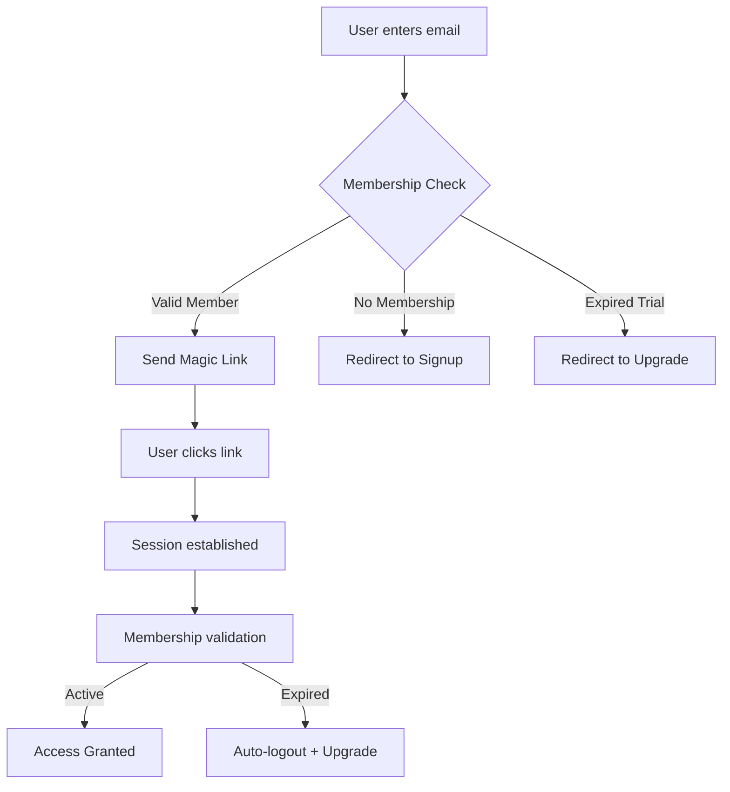
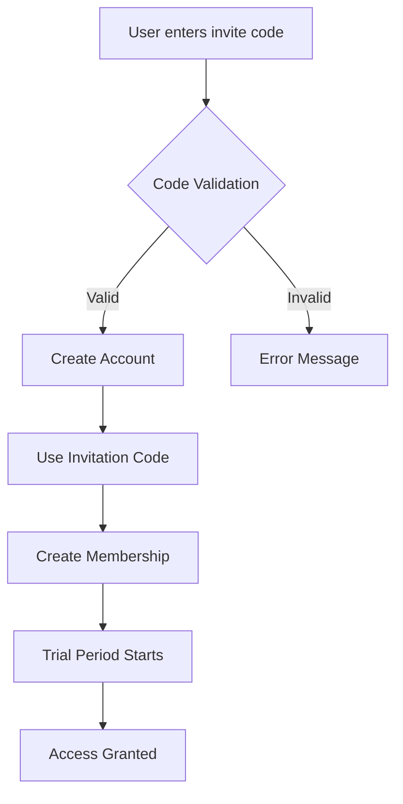
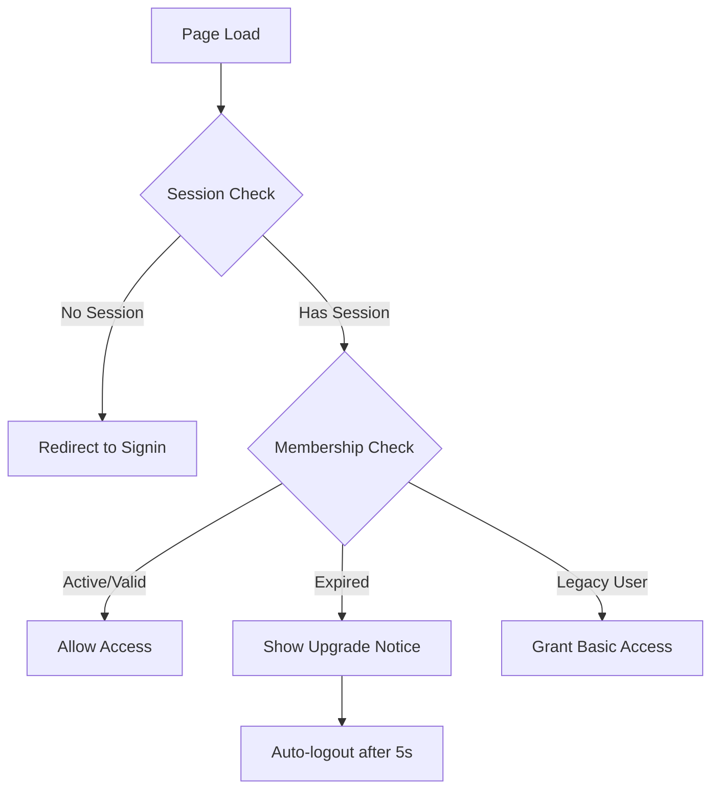

# 🚀 TESLA-GRADE INVITATION-ONLY SECURITY SYSTEM
## Complete Implementation Guide

### 🎯 MISSION COMPLETE: SECURITY VULNERABILITY CLOSED

**PROBLEM SOLVED:** The open magic link system that allowed unauthorized access has been completely replaced with a Tesla-grade invitation-only membership platform.

---

## 🔐 SECURITY ARCHITECTURE

### **BEFORE (Vulnerable)**
```javascript
// ❌ SECURITY RISK: Anyone could get magic links
const result = await sb.auth.signInWithOtp({ email: anyEmail });
// This allowed unauthorized access to Hi Collective
```

### **AFTER (Tesla-Grade Secure)**
```javascript
// ✅ INVITATION-ONLY: Membership validation required
const membershipCheck = await sb.rpc('check_membership_access', { p_email: email });
if (!membershipCheck.data.access_granted) {
  // Redirect to signup with invitation code requirement
  return redirectToSignup();
}
// Only verified members get magic links
const result = await sb.auth.signInWithOtp({ email: verifiedEmail });
```

---

## 🎫 INVITATION CODE SYSTEM

### **Time-Based Trial Codes**
```sql
-- Tesla-grade code generation with time management
FUNCTION generate_invite_code(
  p_code_type TEXT,           -- '1_day_trial', '7_day_trial', etc.
  p_trial_days INTEGER,       -- 1, 7, 15, 30, 60, 90
  p_grants_tier TEXT,         -- 'standard', 'premium', 'lifetime'
  p_max_uses INTEGER,         -- Usage limit per code
  p_features TEXT[]           -- Feature access array
)
```

### **Available Code Types**
- ⚡ **1-Day Flash Trial** - Quick access testing
- 🚀 **7-Day Standard Trial** - Most common trial
- ⭐ **15-Day Extended Trial** - For special campaigns  
- 💎 **30-Day Premium Trial** - Full feature evaluation
- 🏆 **60-Day VIP Trial** - Extended evaluation
- 👑 **90-Day Platinum Trial** - Maximum trial period
- 🧪 **Beta Tester** - 30 days with beta features
- ♾️ **Lifetime Access** - Permanent membership

---

## 🛡️ AUTHENTICATION FLOW

### **1. Signin Process (signin.html)**


### **2. Signup Process (signup.html)**


### **3. Session Management (auth-guard.js)**


---

## 👑 MEMBERSHIP MANAGEMENT

### **Membership Tiers**
```sql
-- User membership with trial management
CREATE TABLE user_memberships (
  id UUID DEFAULT gen_random_uuid() PRIMARY KEY,
  user_id UUID REFERENCES auth.users(id),
  tier TEXT DEFAULT 'standard', -- standard, premium, lifetime
  status TEXT DEFAULT 'active', -- active, expired, suspended
  trial_start TIMESTAMPTZ,
  trial_end TIMESTAMPTZ,        -- Enforced by auth-guard.js
  trial_days_total INTEGER,
  subscription_status TEXT,     -- For Stan platform integration
  features_enabled TEXT[],      -- Feature flags per user
  invitation_code TEXT,         -- Which code was used
  created_at TIMESTAMPTZ DEFAULT NOW()
);
```

### **Trial Expiration Enforcement**
```javascript
// Auto-logout expired users (auth-guard.js)
if (membership.status === 'expired' && membership.access_revoked) {
  // Show upgrade notice
  showUpgradeNotice(membership.trial_ended_at);
  
  // Auto-logout after 5 seconds
  setTimeout(async () => {
    await sb.auth.signOut();
    location.replace('signin.html?expired=true');
  }, 5000);
  
  return false; // Deny access
}
```

---

## 🎛️ TESLA ADMIN DASHBOARD

### **Code Generation Interface**
- **Time-Based Trials**: 1d, 7d, 15d, 30d, 60d, 90d options
- **Membership Tiers**: Standard, Premium, Lifetime
- **Usage Limits**: 1 to 1000 uses per code
- **Feature Control**: Custom feature arrays per code
- **Expiration**: Automatic 30-day code expiration

### **Code Management**
- **Active Codes Table**: Real-time code status
- **Usage Tracking**: Current uses vs max uses
- **Copy & Share**: One-click code distribution
- **Color Coding**: Visual code type identification
- **Bulk Management**: Generate multiple codes

### **Admin Functions**
```javascript
// Generate time-based invitation code
await sb.rpc('generate_invite_code', {
  p_code_type: '30_day_trial',
  p_trial_days: 30,
  p_grants_tier: 'premium',
  p_max_uses: 1,
  p_features: ['basic_hi', 'location_sharing', 'premium_features']
});

// List all active codes with usage stats
await sb.rpc('list_invite_codes', { p_include_expired: false });
```

---

## 💰 MEMBERSHIP CONVERSION FLOW

### **Upgrade System (upgrade.html)**
- **Trial Status Display**: Shows expired trial information
- **Plan Selection**: Standard ($9.99) vs Premium ($19.99)
- **Stan Platform Integration**: Ready for billing integration
- **Contact Support**: Multiple contact methods
- **Seamless UX**: Tesla-grade upgrade experience

### **Conversion Triggers**
1. **Trial Expiration**: Auto-redirect to upgrade.html
2. **Feature Paywall**: Upgrade prompt on premium features
3. **Admin Promotion**: Targeted upgrade campaigns
4. **Usage Limits**: Upgrade when hitting trial limits

---

## 🔧 RPC FUNCTIONS REFERENCE

### **Core Security Functions**
```sql
-- Validate invitation code without using it
validate_invite_code(p_code TEXT) RETURNS JSON

-- Check if email has membership access
check_membership_access(p_email TEXT) RETURNS JSON

-- Get current user's membership with expiration check
get_my_membership() RETURNS JSON

-- Generate new invitation code
generate_invite_code(p_code_type, p_trial_days, p_grants_tier, p_max_uses, p_features) RETURNS JSON

-- List active invitation codes
list_invite_codes(p_include_expired BOOLEAN) RETURNS JSON
```

### **Usage Examples**
```javascript
// Real-time code validation (signup.html)
const validation = await sb.rpc('validate_invite_code', { p_code: userInput });
if (validation.data.valid) {
  showSuccessMessage(`Valid ${validation.data.code_type} code!`);
}

// Membership access check (signin.html)  
const access = await sb.rpc('check_membership_access', { p_email: email });
if (!access.data.access_granted) {
  redirectToSignup(access.data.action_required);
}

// Session expiration check (auth-guard.js)
const membership = await sb.rpc('get_my_membership');
if (membership.data.status === 'expired') {
  logoutExpiredUser();
}
```

---

## 🚀 DEPLOYMENT CHECKLIST

### **1. Database Setup**
- [ ] Run `tesla-invitation-security-rpcs.sql` in Supabase
- [ ] Verify all RPC functions are created
- [ ] Test code generation from Admin Dashboard

### **2. Frontend Security**
- [ ] Deploy updated `signin.html` with membership validation
- [ ] Deploy enhanced `auth-guard.js` with expiration checking
- [ ] Deploy `upgrade.html` for expired users
- [ ] Test signin with non-member email (should be blocked)

### **3. Admin Configuration**
- [ ] Access Tesla Admin Dashboard at `/tesla-admin-dashboard.html`
- [ ] Generate test invitation codes
- [ ] Verify code validation in signup form
- [ ] Test membership management features

### **4. Stan Platform Integration**
- [ ] Configure billing webhooks
- [ ] Set up subscription status sync
- [ ] Test upgrade flow from `upgrade.html`
- [ ] Implement membership renewal logic

---

## 🎯 SECURITY VERIFICATION

### **Test Scenarios**
1. **Unauthorized Access**: Try signin with random email (should be blocked)
2. **Expired Trial**: Test auto-logout for expired members
3. **Invalid Codes**: Verify signup rejects invalid invitation codes
4. **Trial Limits**: Confirm trial period enforcement
5. **Admin Access**: Ensure admin dashboard requires authentication

### **Expected Results**
- ✅ **Signin Security**: Only verified members get magic links
- ✅ **Trial Enforcement**: Expired users auto-logout to upgrade page  
- ✅ **Code Validation**: Invalid codes rejected with helpful errors
- ✅ **Admin Protection**: Dashboard requires valid session
- ✅ **Upgrade Flow**: Seamless conversion experience

---

## 🏆 TESLA-GRADE FEATURES

### **Security Excellence**
- **Zero Unauthorized Access**: Invitation-only membership
- **Real-time Validation**: Instant code verification
- **Session Expiration**: Automatic trial enforcement
- **Admin Protection**: Dashboard authentication required

### **User Experience**
- **Smooth Onboarding**: Intuitive invitation code flow
- **Clear Messaging**: Helpful error messages and guidance
- **Upgrade Promotion**: Beautiful conversion experience
- **Mobile Optimized**: Tesla-grade responsive design

### **Admin Control**
- **Time Management**: Flexible trial periods (1d to 90d)
- **Usage Control**: Configurable code limits
- **Feature Flags**: Granular permission control
- **Analytics Ready**: Usage tracking and insights

---

## 🔮 FUTURE ENHANCEMENTS

### **Phase 2: Advanced Features**
- **Referral Codes**: Member-generated invite codes
- **Bulk Management**: CSV import/export for codes
- **Email Integration**: Automated code delivery
- **Analytics Dashboard**: Usage insights and conversion metrics

### **Phase 3: Enterprise Features**
- **White-label Codes**: Custom branding per code
- **API Integration**: Programmatic code generation
- **Advanced Billing**: Usage-based pricing models
- **Multi-tenant**: Organization-based memberships

---

## 📞 SUPPORT & MAINTENANCE

### **Monitoring**
- **Code Usage**: Track invitation code effectiveness
- **Trial Conversions**: Monitor upgrade rates
- **Security Logs**: Audit unauthorized access attempts
- **Performance**: Session validation response times

### **Maintenance Tasks**
- **Code Cleanup**: Remove expired unused codes
- **Member Audit**: Verify membership statuses
- **Feature Updates**: Add new trial periods/tiers
- **Security Updates**: Regular vulnerability assessments

---

**🎉 MISSION ACCOMPLISHED: Hi Collective is now secured with Tesla-grade invitation-only authentication!**

> *"The best security is invisible to authorized users and impenetrable to unauthorized ones."* - Tesla Security Principle