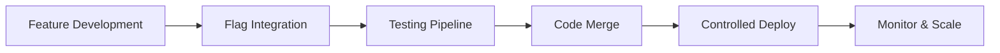

# 🔄 Hi App Change Management Workflow

**Tesla-Grade Development Process**: Feature → Flag → Test → Merge → Deploy  
**Zero-Downtime Philosophy**: Ship fast, fail safe, iterate confidently  
**Last Updated**: 2025-11-01  

---

## Overview

The Hi App follows a Tesla-grade change management workflow that enables rapid iteration while maintaining production stability. Every feature enhancement follows the "Feature → Flag → Test → Merge → Deploy" pipeline.

### Core Principles
- **Feature Flags First**: New features ship disabled by default
- **Incremental Rollout**: Gradual exposure reduces blast radius
- **Quick Recovery**: Instant rollback via flag toggle (no deployment)
- **Data-Driven**: Metrics guide rollout decisions
- **Zero-Downtime**: Changes never interrupt user experience

---

## The 5-Phase Workflow



### Phase 1: Feature Development 🛠️

#### Development Environment Setup
- **Branch**: Create feature branch from `main`
- **Local Flags**: Update `lib/flags/flags.json` with new flag
- **Code**: Implement feature behind flag check

```javascript
// Example: New referral system
if (HiFlags.isEnabled('referrals_v2')) {
  // New referral UI and logic
  renderReferralDashboard();
} else {
  // Existing behavior (safe fallback)
  renderStandardDashboard();
}
```

#### Flag Registration
```json
// lib/flags/flags.json
{
  "referrals_v2": {
    "enabled": false,
    "description": "Enhanced referral system with tiered rewards",
    "phase": "development",
    "owner": "product-team",
    "rollout_start": null
  }
}
```

#### Documentation Requirements
- **Feature Spec**: Document in `docs/features/`
- **Flag Purpose**: Clear description and success criteria
- **Rollback Plan**: Define safe fallback behavior
- **Metrics**: Identify success/failure indicators

---

### Phase 2: Flag Integration 🚩

#### Database Flag Creation
```sql
-- Create production flag (disabled by default)
INSERT INTO hi_flags (
  flag_name, 
  enabled, 
  description, 
  environment,
  target_percentage
) VALUES (
  'referrals_v2', 
  false, 
  'Enhanced referral system with tiered rewards',
  'all',
  0
);
```

#### Client-Side Integration
```javascript
// Defensive coding pattern
class ReferralSystem {
  static render() {
    // Always check flag availability
    if (!HiFlags.isEnabled('referrals_v2')) {
      return this.renderLegacyUI();
    }
    
    try {
      return this.renderNewUI();
    } catch (error) {
      // Graceful degradation on error
      console.error('Referrals v2 error:', error);
      return this.renderLegacyUI();
    }
  }
}
```

#### Feature Toggle Testing
- **Flag Off**: Verify existing functionality unaffected  
- **Flag On**: Verify new feature works correctly
- **Toggle Test**: Rapidly switch flag on/off to test stability
- **Error Cases**: Test feature flag evaluation failures

---

### Phase 3: Testing Pipeline 🧪

#### Automated Testing
```javascript
// Jest test example
describe('Referrals System', () => {
  test('legacy behavior when flag disabled', () => {
    HiFlags.override('referrals_v2', false);
    const result = ReferralSystem.render();
    expect(result).toMatchSnapshot('legacy-referrals');
  });
  
  test('new behavior when flag enabled', () => {
    HiFlags.override('referrals_v2', true);
    const result = ReferralSystem.render();
    expect(result).toMatchSnapshot('new-referrals');
  });
  
  test('graceful fallback on feature error', () => {
    HiFlags.override('referrals_v2', true);
    // Mock feature failure
    jest.spyOn(console, 'error').mockImplementation();
    // Test should still render legacy UI
  });
});
```

#### Manual Testing Checklist
- [ ] **Flag Disabled**: All existing flows work normally
- [ ] **Flag Enabled**: New feature functions correctly  
- [ ] **Mobile Responsive**: Works on all device sizes
- [ ] **Browser Compatibility**: Chrome, Safari, Firefox, Edge
- [ ] **Performance**: No significant impact on load times
- [ ] **Accessibility**: Screen reader and keyboard friendly
- [ ] **Error Handling**: Graceful failures and fallbacks

#### Preview Environment Testing
```bash
# Deploy to preview with flag enabled
vercel deploy --target preview
# Test with production data clone
# Verify feature works with real user patterns
```

---

### Phase 4: Code Merge ✅

#### Pre-Merge Requirements
- [ ] **All Tests Pass**: Automated test suite green
- [ ] **Code Review Approved**: Team review completed
- [ ] **Flag Documentation**: Feature flag docs updated
- [ ] **Rollback Plan**: Clear revert strategy documented
- [ ] **Monitoring Ready**: Metrics and alerts configured

#### Merge Strategy
```bash
# Merge to main branch
git checkout main
git pull origin main
git merge feature/referrals-v2
git push origin main

# Auto-deploy to production (flag still disabled)
# Feature is now live but inactive
```

#### Post-Merge Verification
- **Deploy Success**: Verify clean deployment to production
- **Flag Status**: Confirm flag remains disabled in production
- **Baseline Metrics**: Capture pre-rollout performance data
- **Rollback Test**: Verify instant flag disable works

---

### Phase 5: Controlled Deploy 🚀

#### Gradual Rollout Schedule

**Week 1: Internal Testing (1% of users)**
```sql
-- Enable for internal team first
UPDATE hi_flags 
SET enabled = true, 
    target_percentage = 1,
    user_groups = ARRAY['internal'],
    last_updated = NOW()
WHERE flag_name = 'referrals_v2';
```

**Week 2: Beta Users (5% of users)**  
```sql
-- Expand to beta opt-in users
UPDATE hi_flags 
SET target_percentage = 5,
    user_groups = ARRAY['internal', 'beta'],
    last_updated = NOW()
WHERE flag_name = 'referrals_v2';
```

**Week 3: Broader Testing (25% of users)**
```sql
-- Expand to broader audience
UPDATE hi_flags 
SET target_percentage = 25,
    user_groups = ARRAY['internal', 'beta', 'active'],
    last_updated = NOW()
WHERE flag_name = 'referrals_v2';
```

**Week 4: Majority Rollout (75% of users)**
```sql
-- Scale to majority if metrics good
UPDATE hi_flags 
SET target_percentage = 75,
    last_updated = NOW()
WHERE flag_name = 'referrals_v2';
```

**Week 5: Complete Rollout (100% of users)**
```sql
-- Full deployment if all metrics positive
UPDATE hi_flags 
SET target_percentage = 100,
    last_updated = NOW()
WHERE flag_name = 'referrals_v2';
```

#### Rollout Success Criteria
- **Error Rate**: <2% increase from baseline
- **Performance**: <10% increase in page load time
- **User Engagement**: Positive or neutral impact on core metrics
- **Support Tickets**: No significant increase in user issues
- **Revenue Impact**: Neutral or positive business metrics

---

## Monitoring & Decision Making

### Key Metrics Dashboard
```javascript
// Analytics tracking for feature flags
HiMonitor.trackEvent('feature_flag_evaluation', {
  flag_name: 'referrals_v2',
  enabled: true,
  user_segment: 'beta',
  timestamp: Date.now()
});

// Feature-specific metrics
HiMonitor.trackEvent('referral_action', {
  action: 'code_generated',
  feature_version: 'v2',
  user_id: userId
});
```

### Alert Thresholds
- **High Error Rate**: >5% increase requires investigation
- **Performance Degradation**: >20% slower response time = rollback
- **User Complaints**: >10 similar reports = immediate review
- **Revenue Impact**: Any negative business impact = pause rollout

### Emergency Rollback Triggers
```sql
-- Instant emergency disable
UPDATE hi_flags 
SET enabled = false,
    last_updated = NOW(),
    updated_by = auth.uid()
WHERE flag_name = 'referrals_v2';
```

---

## Rollout Examples

### Example 1: Premium UI Effects
**Feature**: New glassmorphism design system  
**Risk Level**: Medium (visual changes)  
**Rollout**: 1% → 10% → 50% → 100% over 2 weeks  
**Success Criteria**: No increase in bounce rate, positive design feedback  

### Example 2: Token Rewire System  
**Feature**: CSS custom properties for theming  
**Risk Level**: High (affects all styling)  
**Rollout**: Internal → Beta → 5% → 25% → 100% over 4 weeks  
**Success Criteria**: Zero visual regressions, improved theme performance

### Example 3: AI Recommendations
**Feature**: Machine learning content suggestions  
**Risk Level**: Low (additive feature)  
**Rollout**: 25% → 75% → 100% over 1 week  
**Success Criteria**: Increased engagement, positive user feedback

---

## Post-Rollout Flag Cleanup

### Flag Lifecycle Management
```sql
-- After successful 100% rollout (30 days)
-- Flag can be considered for removal

-- Check flag usage first
SELECT COUNT(*) as evaluations
FROM flag_evaluation_log 
WHERE flag_name = 'referrals_v2' 
  AND created_at > NOW() - INTERVAL '7 days';

-- If feature is stable and flag not needed
-- Remove flag and update code to always use new feature
```

### Code Cleanup Process
1. **Remove Flag Checks**: Replace conditional logic with direct implementation
2. **Delete Old Code**: Remove legacy fallback implementations  
3. **Update Tests**: Remove flag-specific test scenarios
4. **Documentation**: Archive flag documentation
5. **Database Cleanup**: Remove flag from hi_flags table

### Before Cleanup
```javascript
if (HiFlags.isEnabled('referrals_v2')) {
  return renderNewReferralUI();
} else {
  return renderLegacyReferralUI();
}
```

### After Cleanup
```javascript
// Flag removed - new feature is now the default
return renderReferralUI(); // (formerly renderNewReferralUI)
```

---

## Workflow Automation

### GitHub Actions Integration
```yaml
# .github/workflows/feature-flag-deploy.yml
name: Feature Flag Deployment
on:
  push:
    branches: [main]

jobs:
  deploy-flags:
    runs-on: ubuntu-latest
    steps:
      - name: Sync Flags to Database
        run: |
          # Sync local flags.json to Supabase hi_flags table
          node scripts/sync-flags.js
```

### Slack Integration
```javascript
// Auto-notify team of flag changes
function notifyFlagChange(flagName, enabled, percentage) {
  const webhook = process.env.SLACK_WEBHOOK_URL;
  const message = {
    text: `🚩 Flag Update: ${flagName} is now ${enabled ? 'ENABLED' : 'DISABLED'} for ${percentage}% of users`
  };
  
  fetch(webhook, {
    method: 'POST',
    body: JSON.stringify(message)
  });
}
```

---

## Troubleshooting Guide

### Common Issues

**Issue**: Flag changes not reflected immediately  
**Solution**: Check flag cache TTL, force refresh client flags

**Issue**: Feature works locally but not in production  
**Solution**: Verify production flag status in Supabase dashboard

**Issue**: Flag evaluation errors in console  
**Solution**: Check flag name spelling, verify database connectivity

**Issue**: Rollback not working  
**Solution**: Verify emergency disable SQL, check network connectivity

### Debug Commands
```javascript
// Browser console debugging
HiFlags.debug(); // Show all flags and their status
HiFlags.isEnabled('flag_name', true); // Force enable for testing
HiFlags.clearCache(); // Force refresh from server
```

---

*Change Management System | Tesla-Grade Reliability | Zero-Downtime Deployments*